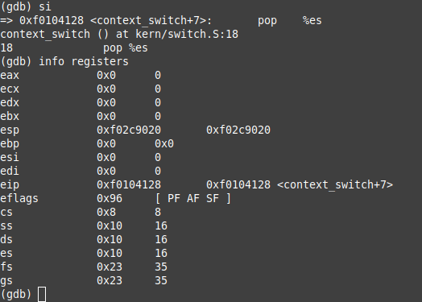

# sched

## Informe cambio de contexto


El context switch o cambio de contexto es un mecanismo utilizado por los sistemas operativos para permitir que varios procesos o hilos se ejecuten de manera concurrente en un mismo núcleo de CPU.
Este proceso implica guardar el estado actual de un proceso o hilo que está siendo interrumpido y cargar el estado de otro que se va a ejecutar.

Junto a la herramienta GDB pudimos visualizar el cambio de contexto:


Podemos notar como los estados de los registros antes del context switch;dentro de context_switch() la primera instrucción a ejecutarla hace que la pila se ajuste 


Luego de la ejecucion de la primera instuccion, podemos visualizar el trapframe con el cambio del registro esp .

La próxima instrucción actualiza el puntero de la pila para que apunte al trapframe a restaurar


Podemos visualizar como el registro esp cambia aputando al trapframe esperado

La proxima instruccion restaura en el trapframe los registros de proposito comun 



Podemos ver como se restauraron los registros de proposito general del trapframe

La proxima instrucción restaura en el trapframe uno de los registros de segmento %es


Podemos ver como se restauro el registro de segmeto  %es del trapframe

La proxima instrucción restaura en el trapframe uno de los registros de segmento %ds


Podemos ver como se restauro el registro de segmeto  %ds del trapframe

La proxima instrucción agrega 8 bytes a la pila para ajustarse para la llamada a la proxima instruccion iret


Podemos ver como cambia el valor del registro esp

La proxima instrucción iret restaura el estado de la CPU a su estado anterior a la interrupción y transfiere el control al código que estaba en ejecución antes de la interrupción.


Podemos ver como se restauraron los registros con el iret y termino el cambio de contexto

##  Scheduler con prioridades
Hicimos un MLFQ para las prioridades. Implementados 3 colas en las que guardamos el principio y el final para encolar y desencolar facilmente
```c
struct  MLFQ_queue {
    envid_t  envs[NENV];
    int  last;
    int  beginning;
};

struct  MLFQ_sched {
    struct  MLFQ_queue  q0;
    struct  MLFQ_queue  q1;
    struct  MLFQ_queue  q2;
    int  total_executions;
    int  current_alive_process;
};
```
Para evitar que los procesos queden starving, se penaliza cada vez que un proceso es ejecutado. Así, si un proceso se ejecuta repetidamente en la cola de mayor prioridad, eventualmente será movido a una de menor prioridad. Tras un número determinado de ejecuciones (definido por MAX_MLFQ_EXECUTIONS), se realiza un boosting que mueve todos los procesos de vuelta a la cola de mayor prioridad.

En cuanto a la implementación de nuestro scheduler, cuando se invoca, este busca en la cola de menor prioridad un proceso que esté en estado RUNNABLE. Si no hay ninguno, intenta continuar con el proceso actual o se llama a sched_halt. Si encuentra un proceso RUNNABLE en la cola de prioridades, lo extrae de su cola actual e inserta en la cola de la siguiente prioridad. Si ya estaba en la cola de mayor prioridad, permanece allí. Luego, se llama a env_run para ejecutar el proceso.

